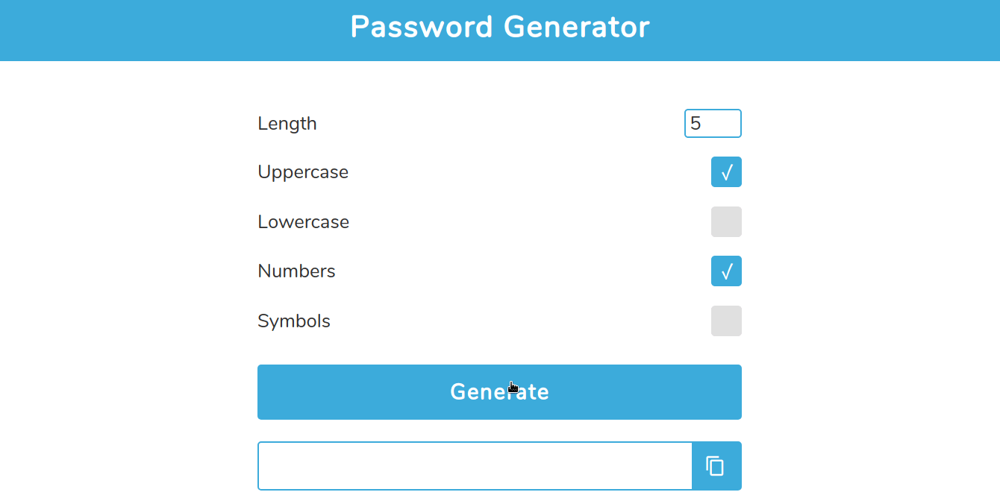

<h1 align="center">Random password generator</h1>

> A simple JavaScript random password generator with settings to choose characters you want to use to make up the password.

## Technologies
* HTML
* CSS
* SASS
* JavaScript

## Disclaimer
I am not responsible for anything bad that happens as a result of your use of this tool or its code. This tool is meant purely for education.
This app use JavaScript's `Math.random()`, which mean it's not cryptographically secure.
